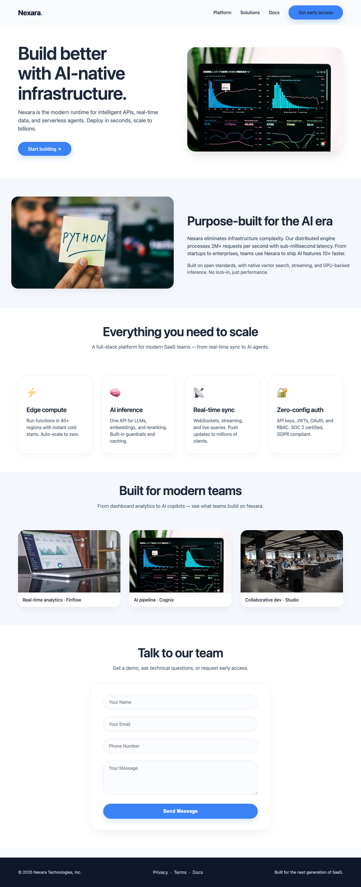
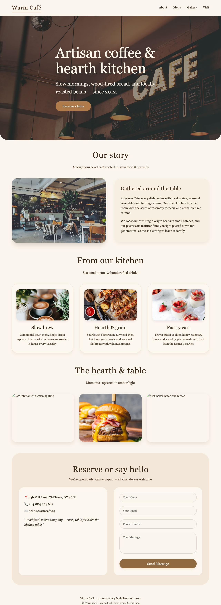
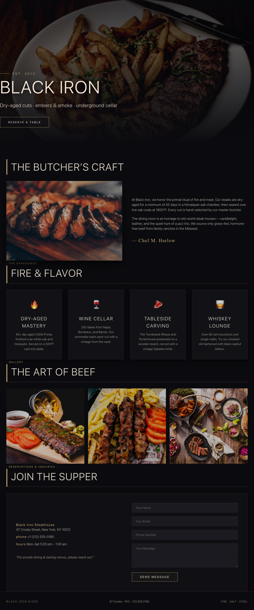
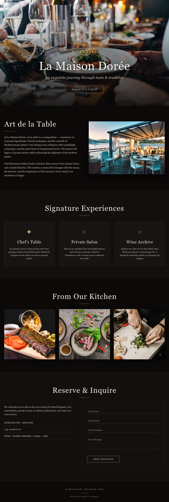
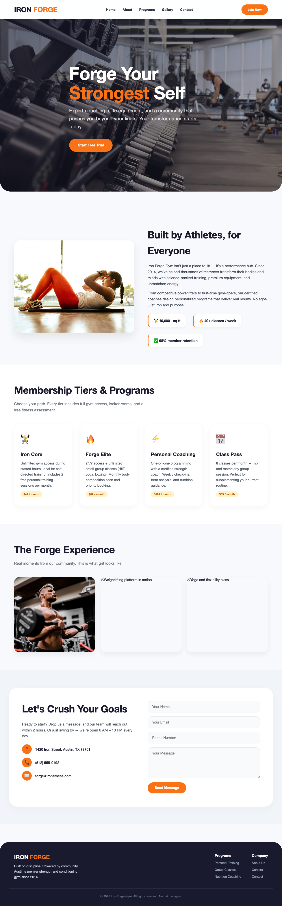
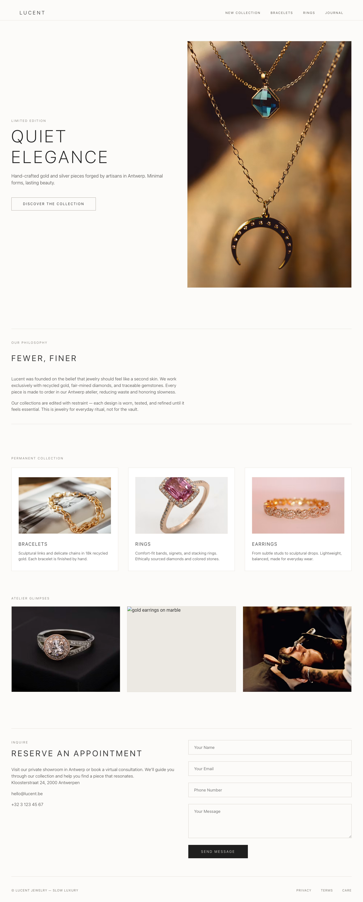
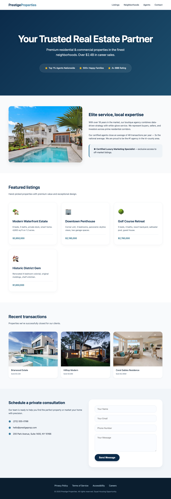
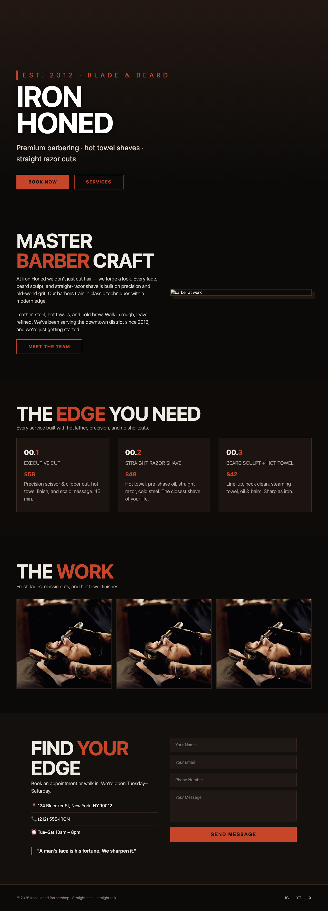
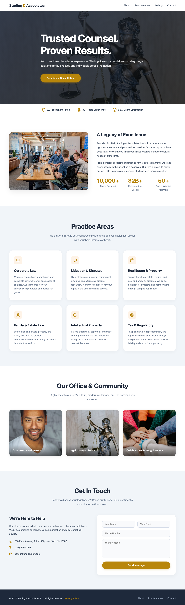

<div align="center">

# Site9

### One Website for Every Business

**Launch a professional website in minutes — no code, no designer, no setup headaches.**

🌐 **Live:** **[site9.in](https://site9.in/)** &nbsp;·&nbsp; ✨ Pick a template → customise → publish to `yourbusiness.site9.in`


</div>

---

## What is Site9?

Site9 is a hosted **website builder for small businesses**. Whether you're a local
shop, freelancer, photographer, restaurant, salon, PG/hostel owner, gym, or
startup, Site9 lets you create a clean, mobile-ready website without writing a
line of code or hiring a designer.

You choose a template, edit your content in a visual builder, and publish — the
site goes live instantly on a free `yourbusiness.site9.in` subdomain (custom
domains on paid plans).

> **Who it's for:** business owners who need to *get online and get found* fast —
> not developers. Everything is designed around "launch in minutes, run it
> yourself afterwards."

---

## Why it's useful

| Problem | How Site9 helps |
| --- | --- |
| "I don't have a website and can't afford an agency." | Free to start, plans from **₹9/month**. No setup fees. |
| "I don't know how to code or design." | 100+ ready-made templates + a visual page builder. No technical skills needed. |
| "I need customers to find and contact me." | Built-in SEO, Google Maps, contact forms, lead capture, and a WhatsApp button. |
| "I want to sell online / take bookings." | Optional shop (ecommerce), bookings, and blog modules. |
| "I want it to look good on phones." | Every template is mobile-responsive out of the box. |
| "I want to launch *today*." | Publish to a live subdomain instantly; show a "coming soon" page while you finish. |

---

## See it in action

**Pick from 100+ templates and launch in minutes** — spanning every common
business type and 8 visual styles (`bold`, `corporate`, `dark`, `elegant`,
`minimal`, `modern`, `playful`, `warm`), all mobile-responsive:

| | | |
| :---: | :---: | :---: |
|  |  |  |
| **Modern SaaS landing** | **Warm café** | **Dark steakhouse** |
|  |  |  |
| **Elegant fine dining** | **Modern gym** | **Minimal jewelry** |
|  |  |  |
| **Real estate agent** | **Bold barbershop** | **Modern law firm** |

> All ~100 preview images live in [`public/template-previews/`](public/template-previews/).
> Each template is fully editable in the builder after you pick it — browse the
> live gallery on **[site9.in](https://site9.in/)**.

---

## How it works

1. **Start** — sign up at [`/start`](https://site9.in/start) and tell Site9 about your business.
2. **Pick a template** — browse [`/templates`](https://site9.in/templates) and choose a starting point.
3. **Customise** — edit text, images, sections, colours, and pages in the visual builder (`/build`).
4. **Publish** — go live instantly at `yourbusiness.site9.in`, or connect a custom domain on a paid plan.
5. **Grow** — add a shop, bookings, a blog, contact forms, SEO, and analytics as you scale.

---

## Plans

| Plan | Price | Highlights |
| --- | --- | --- |
| **Starter** | **₹9/mo** | Business profile site, WhatsApp button, contact form, free `.site9.in` subdomain |
| **Business** | **₹99/mo** | Adds galleries, SEO tools, analytics, and AI content |
| **Pro** | **₹999/mo** | Custom domain, multi-page sites, premium templates, priority support |

*Free to start — no credit card, no setup fees, cancel anytime.*

---

## Features

- 🎨 **100+ templates** across 8 style families, all mobile-responsive
- 🧱 **Visual page builder** — edit sections, content, and pages without code
- 🌍 **Instant publishing** to a free `yourbusiness.site9.in` subdomain (multi-tenant)
- 🔗 **Custom domains** on paid plans
- 🛒 **Online shop** — products, cart, and checkout
- 📅 **Bookings** — let customers book appointments/slots
- ✍️ **Blog** — publish posts and updates
- 📨 **Contact forms & lead capture**, WhatsApp button, Google Maps
- 🔎 **Built-in SEO** and analytics
- 📣 **Social media management** (Instagram + Facebook)
- 🚧 **"Coming soon"** launch pages with email capture
- 👥 **Multiple portals** — customer/account, admin, employee, and superadmin

---

## Tech stack

| Layer | Technology |
| --- | --- |
| Framework | Next.js 16 (App Router, Turbopack), TypeScript (strict) |
| Styling | Tailwind CSS v4, shadcn/ui |
| Database | Supabase (Postgres only — **not** Supabase Auth) |
| Auth | Custom JWT via `jose`, HTTP-only `session` cookie; bcrypt password hashing; Google OAuth |
| Payments | Stripe / Razorpay |
| Email | Resend |
| File storage | Cloudflare R2 |
| Hosting | Vercel (wildcard subdomains for tenant sites) |

---

## Project structure

```
src/app/
├── (public)/      # marketing site + tenant-facing modules (shop, blog, book, work, services)
├── (auth)/        # login, register, start (onboarding), forgot-password
├── (build)/       # the visual website/page builder
├── (account)/     # customer account area
├── (admin)/       # tenant admin portal
├── (employee)/    # employee portal
├── (superadmin)/  # platform/superadmin portal
├── (survey)/      # surveys
├── p/[slug]/      # published tenant pages
├── templates/     # template gallery + per-template preview
└── api/           # auth, billing, store, book, intake, social, templates, cron, …
```

See [`PROJECT_BRIEF.md`](PROJECT_BRIEF.md) for the data model, auth architecture,
and environment variables, and [`docs/`](docs/) for the changelog, decisions, and
known issues.

---

## Getting started

This project uses **pnpm** (per workspace standards).

```bash
# install dependencies
pnpm install

# create .env.local and fill in your keys
# (see PROJECT_BRIEF.md for the full list of required variables)

# run the dev server
pnpm dev
```

Then open [http://localhost:3000](http://localhost:3000). `npm run dev` also works.

```bash
# production build
pnpm build && pnpm start
```

> **Note:** this project pins a build of Next.js with breaking changes from older
> versions. See [`AGENTS.md`](AGENTS.md) and the bundled docs under
> `node_modules/next/dist/docs/` before contributing code.

---

<div align="center">

Built with ▲ Next.js · Deployed on Vercel · **[site9.in](https://site9.in/)**

</div>
